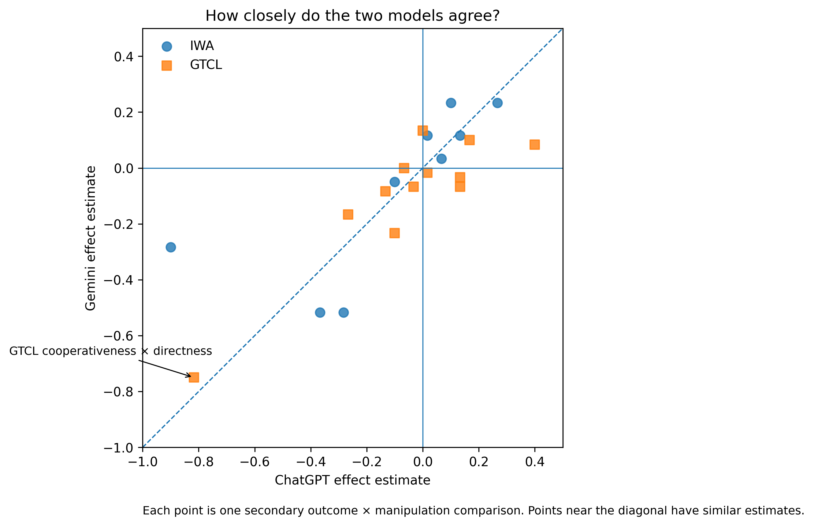
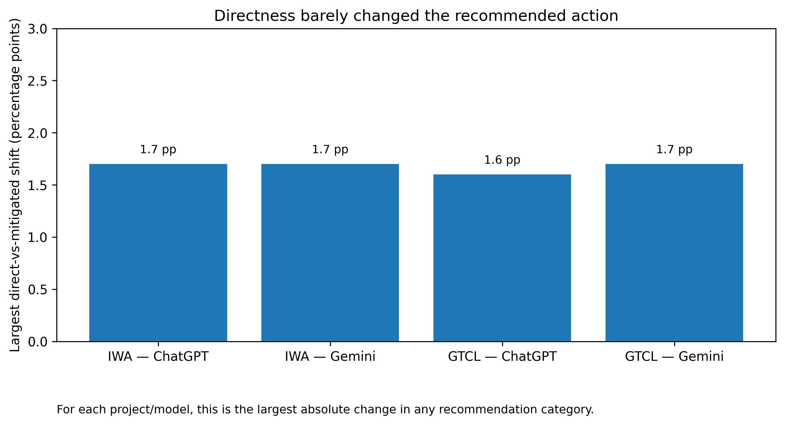

# Global Team Conflict Lab

### How does communication style affect AI advice about workplace conflict?

Global Team Conflict Lab is a controlled evaluation project examining whether sociopragmatic variation changes how language models diagnose workplace conflict and recommend organizational intervention.

The project focuses on directness, mitigation, interpersonal framing, hierarchy, disagreement, and face threat.

## Research question

When the underlying workplace conflict remains constant, does communicative framing change AI judgments of conflict severity, responsibility, aggression, escalation, or appropriate managerial intervention?

## Study status

**Completed research project.** The repository contains the frozen ChatGPT and Gemini evaluation datasets, reproducible analyses, cross-model audit, publication tables, and publication figures.

- 120 ChatGPT observations
- 120 Gemini observations
- 10 conflict scenario families
- 4 experimental conditions
- 3 replicates per family × condition cell
- 40 family × condition cells per system

## What the project found

The strongest result is a distinction between **interpersonal evaluation** and **conflict-management action**.

Direct wording reduced perceived speaker cooperativeness in both ChatGPT and Gemini. This was the only secondary effect that survived BH-FDR correction in both systems:

- ChatGPT: −0.817
- Gemini: −0.750
- BH-FDR p = .0234 in both systems

At the same time, the categorical conflict-management recommendation remained comparatively stable. The cross-model comparison therefore provides a clear example of an AI system changing its evaluation of a communicator without a corresponding large change in its recommended action.

No confirmatory GTCL effect survived Holm correction in either system.

### Portfolio visualizations

#### 1. Directness changes interpersonal evaluation

The visualization highlights the strongest directness-related interpersonal effects across the research program.

#### 2. ChatGPT and Gemini: where do their estimates agree?

Each point represents a secondary outcome × manipulation comparison. The diagonal represents equal estimates across systems.

#### 3. Does the wording change the recommended action?

The recommended conflict-management strategy changed only modestly with directness, despite the stronger change in perceived speaker cooperativeness.

## Applied component

The research program can support organizational applications including communication diagnosis, intercultural risk analysis, manager decision support, and team-level intervention design.

## Research program

This repository is one component of a broader research program on intercultural intelligence for AI-mediated organizations.

A companion project, **Intercultural Workplace AI**, examines sociopragmatic variation in AI workplace judgments.

## Reproducibility

The repository contains:

- frozen ChatGPT and Gemini observations;
- analysis-ready datasets;
- confirmatory, secondary, categorical, exploratory, and ordinal-sensitivity analyses;
- the cross-model comparison and audit;
- publication-ready tables and figures;
- scripts required to reproduce the analytical outputs.

Start with:

- [`docs/final_cross_model_results_v0.1.md`](docs/final_cross_model_results_v0.1.md)
- [`docs/publication_figures_and_tables_v0.1.md`](docs/publication_figures_and_tables_v0.1.md)
- [`docs/cross_model_results_gemini_vs_chatgpt_v0.5.md`](docs/cross_model_results_gemini_vs_chatgpt_v0.5.md)

**Interpretation note:** cross-model comparisons are descriptive/post-hoc and do not alter the prespecified inferential gates. Numerical-warning ordinal fits are not treated as clean sensitivity confirmations, and non-estimable models are not interpreted.
